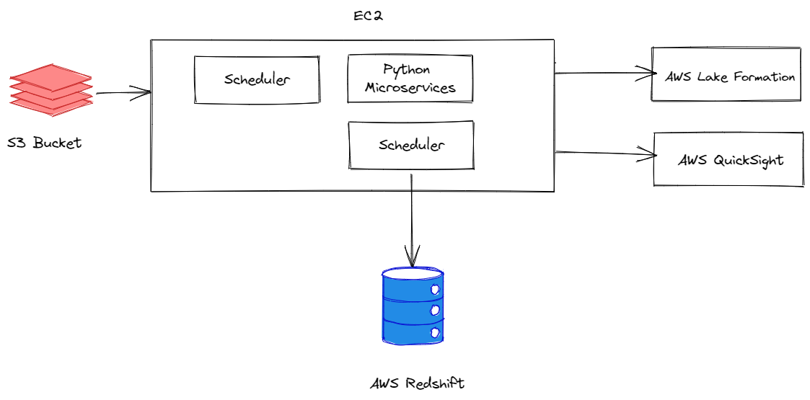

### ETL 

Overview about the Design



1. High level process flow

Scehduler can run every x minute(s) or on specific time as required.  using diff()
we can compare old file and new pulled file( impression or campaign data), this will trigger the 
transformation operation. 

there will be two tables `curr_impression` and `curr_campaign` which will store most 
recent data. After the data has been replaced in the table, the tables
are joined on `campign_id` and stored in `ad_data` which represents most updated data
after transformation.

At the end of day, the data from `ad_data` is upserted into `historical_ad_data`, this
data from redshift is then pushed to data-lake using AWS Lake Formation.

2. Campaign metadata can change over time, and the existing data-lake files with the updated data as campaign data is updated. How would you update your process to make changes to historical data over time? How would you optimize this process?

Whenever new datasets are pulled from s3 either impression data or campaign data,
the transformation script will run and will maintain up-to-date data in `ad_data`. 

whenever we push `ad_data` to `historical_ad_data` we will use `upsert` method so that 
campaign data is updated based on campaign_id. 


3. The product manager would like to have a dashboard that displays the metrics listed below. Would you need to update your process to pull these metrics? If yes, then how would it change?
a. The status of each file load
b. Row counts per file
c. Standard deviation of the column “viewing_percentage” over the past 200 days ?
   
We can maintain a new table `operation_status` which will add data has triggered the process, 
the status of the operation and other metadata. This table will append row each time a new filed is
pushed to s3. 

a. 
```sql
    SELECT status FROM operation_status WHERE date=DATE(NOW());
``` 

b. 
```sql
    SELECT COUNT(campaign_id) FROM historical_ad_data WHERE date= DATE(NOW());
```

c. 
```sql
    SELECT STDDEV(viewing_percentage) as std_dev_view_percentage FROM
    (
    SELECT viewing_percentage
    FROM historical_ad_data
    WHERE date > current_date - interval '200 day'
    ) as t1
    
```